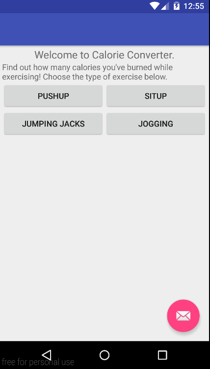
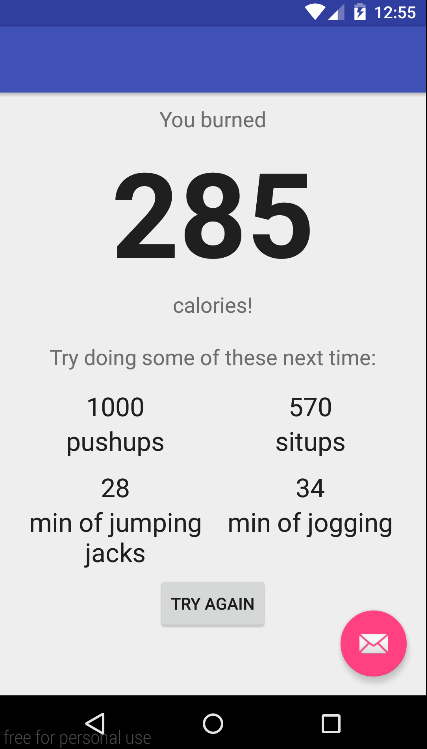

# PROG 01: Crunch Time

This app calculates the amount of calories you've burned after doing a certain exercise. First choose the type of exercise you did. Then type the reps or minutes you've done and click "CONVERT". On the final screen, you see the converted calories and suggestions of other exercises you can do to get the same amount calories. At the bottom of the screen, you can press "TRY AGAIN" to repeat the process and convert more exercises to calories.

## Authors

Ruth Linda Zhang ([rlzhang@berkeley.edu](mailto:your_email@berkeley.edu))

## Demo Video

See [Calorie Converter] (https://youtu.be/kp5nk7idseU)

## Screenshots

## Acknowledgments

Lots of stackoverflow.com
